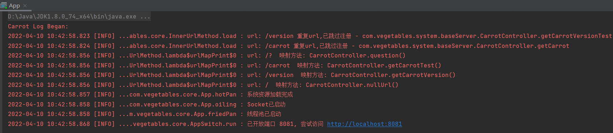
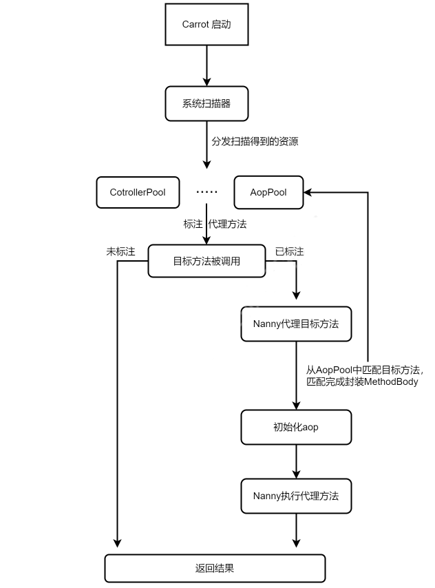

# Carrot

#### 介绍
通过 Carrot ，你可以轻松地构建一个简单的web程序。

Carrot 的优势：App.start(**.class) 一键启动，如果你想快速构建一个简单的web程序，Carrot 是你的选择。
#### 快速开始

添加maven依赖
```xml
<dependency>
    <groupId>com.vegetables</groupId>
    <artifactId>Carrot</artifactId>
    <version>0.0.1</version>
</dependency>
```

创建并启动
```java
public class Test {
    public static void main(String[] args){
        App.start(Test.class);
    }
}
// App.start(Test.class);   Carrot根据Test所在位置进行包扫描
// 当然你也可以通过在项目根目录下，添加配置文件 config.yml 配置需要进行扫描的包名。（app.start.package: **.**.**）
```

#### 个性化配置

你可以通过在项目根目录下，添加配置文件 config.yml，配置系统参数。

可配置参数示例：
```yaml
# 服务端口号
app.port: 8000
# 系统环境
app.active: test
# 服务名
app.name: myWebServer
# 服务描述
app.desc: 我的web服务器
# 系统版本
app.version: 0.0.1
# 作者
app.author: BeanInJ
# 密钥
app.key: Q2Fycm90Cg==
# 请求缓存池大小（请根据服务器自身运行配置）
app.channel.size: 1024
# 待扫描包名（Controller、Service、Aop 不在待扫描包下无效）
app.start.package: com.excemple.test
```

#### 内置接口

用于测试的内置接口：


| 接口                            | 测试内容|理想返回内容|
|----|----|----|
| http://localhost:8081         | 控制器方法，正常返回                     | 服务注册名：carrot, 系统版本：1.0.0, Carrot author: BeanInJ |
| http://localhost:8081/author  | 控制器方法，正常返回                     | Carrot author: BeanInJ                          |
| http://localhost:8081/carrot  | 控制器方法，强制覆盖重复url                | 服务注册名：carrot, 系统版本：1.0.0                        |
| http://localhost:8081/version | AOP切面类：VersionControllerAop    | 1.0.1                                           |
| http://localhost:8081/?       | 前置拦截器：UrlIntercept             | 想做点什么呢？                                         |
| http://localhost:8081/404     | 后置拦截器：ResponseIntercept，404状态拦截 | 404 - Not Found : /404                          |
| http://localhost:8081/123     | 后置拦截器：ResponseIntercept，空返回拦截  | /123 - 返回 null                                  |




#### 内置AOP介绍

Carrot 提供了一个内置的AOP实现，可以通过 @AOP 注解到你的类上，以完成对Controller方法执行前、后、环绕、异常、最终这个几个状态上的控制。

如果你想将AOP拦截器拓展到你的类上，可以通过 ```Nanny nanny = new Nanny(类名);``` 创建一个代理类对象。

AOP执行流程图，如下：



#### 请求流程与生命周期

系统启动过程：

```加载资源 --> 开放端口（打开socket） -->  开启线程池（一个请求进来，申请一个线程）```


加载资源过程：

```配置加载 -->  日志加载 --> 类工厂初始化 --> 扫描器初始化 --> 开启包扫描扫描 --> 类工厂分发资源到“类池” --> url映射器初始化```

> (类池只会等待被加载或调用,也就是它的"技能"是被动的)


url映射器：

```从 controller类池 解析url并保存```

一个请求进来（数据类型的传递）：

```线程1：  channel.read --> ByteBuffer  -->  baseHttp --> request --> response --> baseHttp --> ByteBuffer --> channel.write.close```


一个请求进来（程序流程，这里每一步都可以往后跳载）：

```线程1：channel.read --> 前置拦截器 -->  request --> url映射器 --> "控"制"器" -->  response --> 后置拦截器 --> 异常拦截器  ("代表aop) --> channel.write.close```


#### 待完成、待优化

1、写一个示例程序，包含了各种功能的使用，以及mybatis的嵌入

2、优化请求线程结构                      √

3、优化配置中心 

4、优化AOP切入逻辑                      ing（采用第二种实现方案）

5、实现IOC容器（控制反转、自动注入）

6、包结构重新调整                       ing

7、接入mybatis配置

8、实现缓存、Session                    ing

9、实现url加密、解密、缩短

10、测试本项目运行后所占内存大小，优化内存

11、目前url是字符串，看是否能设计为树结构


关于aop实现的两种方案：

1、提前解析aop方法，封装为aop方法体。

也就是在系统启动时解析切面类，最终得到“代理列表”（目标方法+切面方法体）。
当每次调用某个方法前，就去“代理列表”检查，该方法是否属于要切入的方法。

优点：切入方法时，执行速度更快，因为切面方法体都是提前解析好了的，直接调用即可。

缺点：当目标方法过多时，会解析出来很多aop方法体，占用内存。


2、不提前封装，目标方法调用时aop切入时再封装执行。

优点：不占用太多内存。

缺点：每个请求进来都需要解析aop类，当aop类过多时可能会拖慢响应速度。


#### 设计模式

单例模式：在本框架中，控制器类、过滤器类等的创建采用的是饿汉式单例模式。


工厂模式：所有从扫描器获取得到的类，都是统一经过类工厂去处理的。


装饰器模式：HTTP请求体和响应体的设计，采用了装饰器模式。